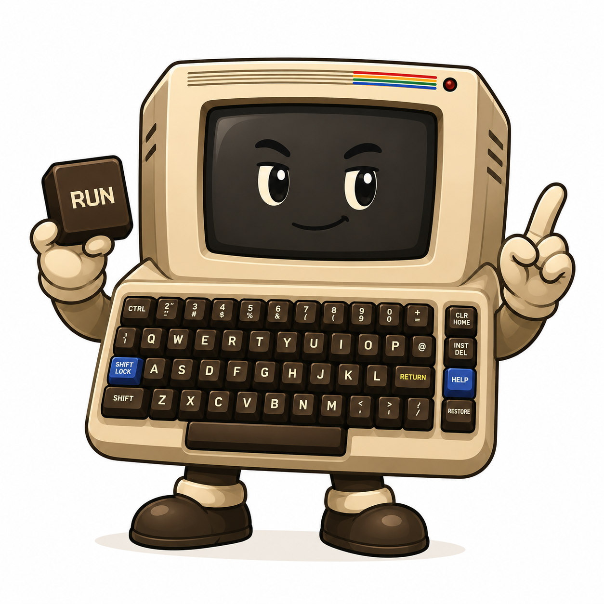
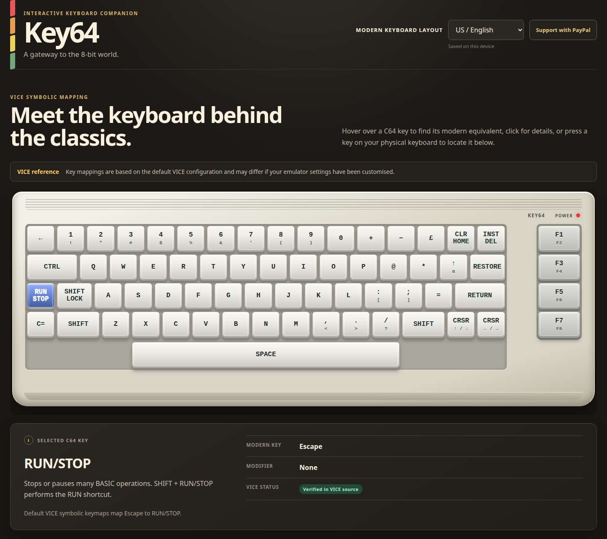

# Key64

**A gateway to the 8-bit world.**

<p align="center">
  
</p>

Key64 is a small, open-source keyboard helper for people who already use a Commodore 64 emulator. It shows an interactive C64 keyboard and explains which modern key or combination corresponds to each C64 key.

Key64 is **not** an emulator. It contains no ROMs, machine emulation, accounts, backend or tracking.

## Use Key64 online

**[Open Key64](https://uraroga.github.io/key64/)**

<p align="center">
  
</p>

No installation is required. Open Key64 in your browser and use the
interactive Commodore 64 keyboard as a reference while using your C64 emulator.

## Features

- Hover over any C64 key to see its modern equivalent.
- Click a key for its purpose, modifiers and mapping notes.
- Press a physical key to highlight the corresponding C64 key.
- Explore a readable C64C-style keyboard with a separate function-key bank.
- Read concise explanations of the C64's unusual keys.
- Use the page with mouse, keyboard or assistive technology.

## Supported host keyboard layouts

- US / English
- Italian
- German
- French

Key64 references the current VICE GTK3 **symbolic** keymaps. Mappings may differ when VICE settings are customised, when another VICE UI backend is used, or when another emulator is used. See [docs/verification.md](docs/verification.md) for the exact verification boundary.

## Run locally

No build step or dependencies are required. Because the JavaScript uses native ES modules, serve the directory over HTTP:

```bash
python3 -m http.server 8080
```

Then open `http://localhost:8080`.

Run the data checks with Node.js:

```bash
node tests/data.test.mjs
```

## Deployment

GitHub Pages serves the static project directly from the root of the `main` branch. No build step or deployment workflow is required.

## Structure

```text
.nojekyll                 Disable Jekyll processing on GitHub Pages
index.html                 Page structure
css/styles.css             C64-inspired responsive presentation
js/app.js                  UI and input interaction
js/data/keyboard.js        Visual keyboard geometry and legends
js/data/descriptions.js    Key explanations
js/data/layouts.js         Modern host-layout geometry and chords
js/emulators/vice.js       VICE-specific mapping profile
tests/data.test.mjs        Structural mapping checks
docs/reference/c64_mascot.png  README mascot image
docs/images/key64-preview.png  Current application screenshot
docs/verification.md       Verified and provisional mapping boundary
```

The separation between keyboard geometry, host layout and emulator profile allows another emulator to be added without redesigning the application.

## Licence

MIT. Key64 uses no Commodore ROMs, logos or copyrighted artwork.
